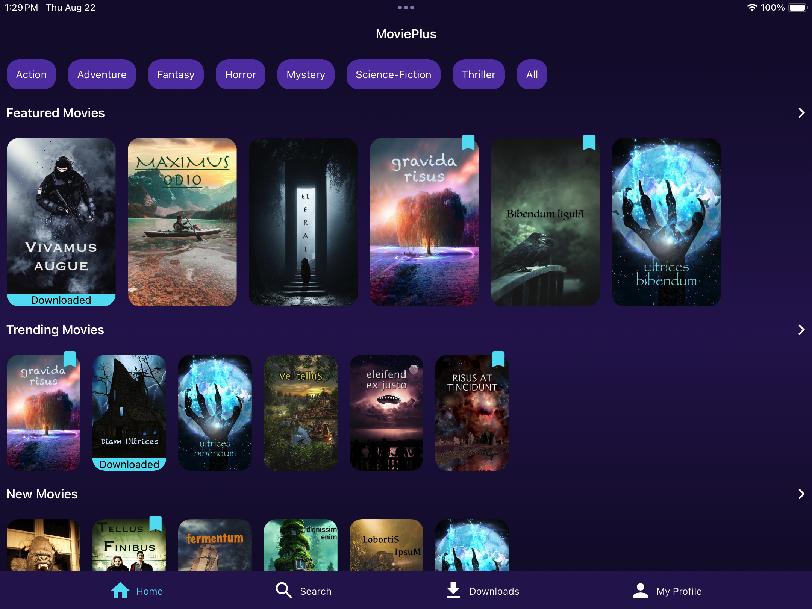
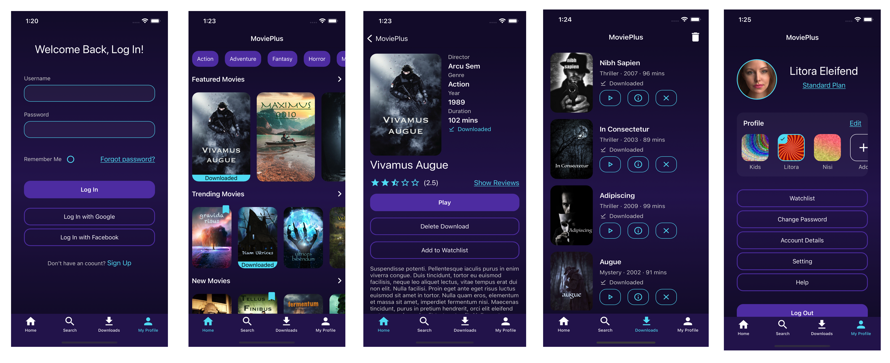

# MoviePlus (Demo App)

This app demonstrates various techniques for building a desktop and mobile application that takes advantage of native platform features, and adapts to a wide range of device needs all from a single codebase. This is NOT a complete application.

### Credits

* Xamarin.Essentials: https://github.com/xamarin/Essentials
* Xamarin.CommunityToolkit: https://github.com/xamarin/XamarinCommunityToolkit
* Xamarin.Forms.PancakeView: https://github.com/sthewissen/Xamarin.Forms.PancakeView
